# qrfactor

**A manual to simultaneous Q- and R-mode factor analysis of spatial data in R**

This manual teaches the `qrfactor` R package from the ground up. It assumes
only basic R literacy and explains every term as it appears. **Part 1** runs
the whole method on a table of African freshwater-use data — one `qrfactor()`
call giving PCA, R-mode, Q-mode, simultaneous Q+R, principal coordinate
analysis and multidimensional scaling. **Part 2** takes the *same* variables
into spatial mode on the bundled African shapefile, writing factor scores back
to the attribute table and drawing choropleth maps. **Part 3** is a full
reference, a reproducibility script, and honest limits.

Dr George Owusu
Department of Geography and Resource Development, University of Ghana

```
Version 1.5
Package: qrfactor
Core is pure R — spatial input uses 'sf' and 'sp'; maps use sp::spplot
For: geographers, hydrochemists, ecologists and anyone who classifies
     both variables (R-mode) and samples (Q-mode) at once
Prerequisites: basic R literacy
License: GPL-2
```

> **Every number and figure in this manual was produced by running the package.**
> The script that regenerates them, `reproduce_manual.R`, ships in this folder;
> its console output is `repro_output.txt` and its figures are in `figures/`.
> Run it and you get exactly the tables and plots printed here.

---

## Contents

**Part 1 — the method, step by step**
1. What this package does
2. Installing and loading
3. The fitted object: your workbench
4. Getting the data
5. `qrfactor()`: the one call
5b. Data types, and the assumptions behind them
6. PCA — the shared foundation
7. R-mode: structure among variables
8. Q-mode: structure among samples
9. Simultaneous Q+R: the biplot
10. Scores
11. `print()` and `summary()`
12. Scaling: the single most important choice
13. Transforming skewed variables
14. Principal coordinate analysis (PCoA)
15. Multidimensional scaling (MDS)

**Part 2 — spatial mode**
16. From table to map
17. Reading a shapefile
18. Scores written back to the attribute table
19. `plot="map"`: the choropleths
20. Clustering: `plot="cluster"` and `"compare"`
21. Testing the clusters: ANOVA and Kruskal–Wallis
22. Distributional diagnostics: `type="diagnose"`
23. Joining a CSV to a shapefile
24. Using an in-memory spatial object
24b. The African water paradox, in numbers
24c. What makes `qrfactor` robust

**Part 3 — reference**
25. `qrfactor()` argument reference
26. `plot.qrfactor()` argument reference
27. The object's elements
28. Reproducing the figures
29. Honest limits and caveats
30. Glossary
31. Exercises

---

# PART 1 — The method, step by step

## 1. What this package does

Most multivariate methods classify *one* thing at a time. **R-mode** factor
analysis finds structure among your **variables** (which measurements move
together?). **Q-mode** finds structure among your **samples** (which
observations resemble each other?). Traditionally you run these separately, in
different tools, and reconcile them by hand.

`qrfactor` does both at once, from a single call, and returns one object that
carries the R-mode loadings, the Q-mode loadings, and — its distinctive move —
*both on a single set of axes* so variables and samples can be read on the same
biplot. When the input is a shapefile, it also writes the resulting scores and
cluster memberships straight back to the map's attribute table, so the last
step of the analysis is a map.

> **The problem this manual solves — Africa's water paradox.**
> Africa is described, in the same breath, as *water-rich* and *water-stressed*.
> Both cannot be true everywhere. The question has two sides that a single
> method rarely answers together: **(R-mode)** which measurements define how a
> country uses water, and **(Q-mode)** which countries resemble each other in
> that use? We put the bundled data — domestic, industrial and agricultural
> withdrawal, renewable resources, total and per-capita withdrawal for 50
> African countries — through one `qrfactor()` call and read the answer off the
> biplot and the map. The finding, developed across this manual: **water *use*
> and water *availability* are almost independent, and the heaviest users are
> on average the least resource-endowed.** That is the paradox, quantified.

Six analyses come out of the one function:

| Analysis | What it answers |
|---|---|
| PCA | What are the dominant axes of variation? |
| R-mode factor analysis | Which variables group together? |
| Q-mode factor analysis | Which samples group together? |
| Simultaneous Q + R | How do variables and samples relate on shared axes? |
| Principal coordinate analysis (PCoA) | Ordination from a distance view |
| Multidimensional scaling (MDS) | A low-dimensional map of sample similarity |

**Key terms, defined once**

- **Loading** — the correlation-like weight linking an original variable to a
  factor (axis). Large magnitude = the variable defines that axis.
- **Score** — the coordinate of a sample (or variable, in Q-mode) on a factor.
- **Eigenvalue** — the amount of variance an axis captures. Bigger = more
  important. The Kaiser rule keeps eigenvalues > 1.
- **Q-mode vs R-mode** — Q classifies *samples/rows*; R classifies
  *variables/columns*.
- **Biplot** — one plot showing variables and samples together.

## 2. Installing and loading

From GitHub:

```r
# install.packages("remotes")
remotes::install_github("gowusu/qrfactor")
library(qrfactor)
```

The core is pure R. For the **spatial** workflow (Part 2) you also need `sf`
(to read shapefiles) and `sp` (for the maps):

```r
install.packages(c("sf", "sp"))
```

Three contributed packages power specific diagnostics and are pulled in
automatically: `cluster` (cluster plots), `mvoutlier` (multivariate outliers),
`pvclust` (bootstrap cluster support).

**System note.** Verified on R 4.6.0 (Windows) with `sf` 1.1-1 and `sp` 2.2-3.
Input data must be **numeric** — drop or encode categorical columns before you
start.

## 3. The fitted object: your workbench

Everything revolves around the object returned by `qrfactor()`. Think of it as
a workbench that carries the decomposition and every derived quantity. Printing
`names()` on it shows the full contents:

```r
names(mod)
```
```
 [1] "gisdata"        "correlation"    "eigen.vector"   "eigen.value"
 [5] "diagonal.matrix" "r.loading"     "q.loading"      "rloading"
 [9] "qloading"       "rloadings"      "qloadings"      "combined.loadings"
[13] "r.scores"       "q.scores"       "rscores"        "qscores"
[17] "combined.scores" "data1"         "rownames"       "variables"
[21] "mds"            "coordinates"    "x.standard"     "loadings"
[25] "scores"         "pca.loadings"   "pca"            "pca.scores"
[29] "pcascores"      "variance"       "cumvariance"    "data"
[33] "normal"         "transform"      "nfactors"       "call"
```

Several names are convenience aliases (`r.loading` = `rloading` = `rloadings`;
`q.scores` = `qscores`; `pca` = `pca.loadings`). Section 27 catalogues all of
them with their dimensions.

## 4. Getting the data

The package ships a table of water use for **50 African countries**. Load it —
in a real study you would swap in your own numeric table in the same shape.

```r
csv <- system.file("external", "Africanfreshwater.csv", package = "qrfactor")
raw <- read.csv(csv)
head(raw)
```
```
  ID CODE      COUNTRY Year  Domestic  Industry Agricultur Population Resources
1  1  ALG      Algeria 2000 37.662273 22.605373 111.091935  35.422589      11.6
2  2  ANG       Angola 2000  4.238469  3.132781  11.056876  18.992707     184.0
3 20  BEN        Benin 2001  4.515976  3.245858   6.350591   9.211741      25.8
4 21  BOT     Botswana 2000 39.391799 17.293960  39.391799   1.977569      14.7
5 22  BUF Burkina Faso 2000  6.385576  0.491198  42.243042  16.286706      17.5
6 23  BUR      Burundi 2000  5.757935  2.042526  26.212421   8.518862       3.6
  withdrawal perCapitaW perCapitaR
1       6.07  171.35958   0.327475
...
```

We analyse six numeric columns — domestic, industrial and agricultural water
use, renewable resources, total withdrawal, and per-capita withdrawal:

```r
var <- c("Domestic","Industry","Agricultur","Resources","withdrawal","perCapitaW")
```

**Reading the raw data.** Even before any analysis, the extremes hint at the
paradox. The largest *agricultural* users are **Swaziland (839), Sudan (835),
Madagascar (710) and Egypt (695)** — arid or irrigation-dependent economies.
The largest *renewable resource* holders are **Congo (1283) and the Democratic
Republic of the Congo (832)** — equatorial, water-abundant, yet with tiny
withdrawals (Congo's total is 0.03). So the countries with the most water are
not the ones using the most. Factor analysis turns that eyeball impression into
measured axes.

## 5. `qrfactor()`: the one call

Point `qrfactor()` at the CSV and name the variables. That is the whole model.

```r
mod <- qrfactor(csv, var = var)
mod$call
#> qrfactor.default(source = csv, var = var)
dim(mod$data)
#> [1] 50  6
```

`qrfactor()` accepts input five ways — a **data frame**, a **CSV/txt path**, a
**shapefile** (folder + layer), an **in-memory spatial object**, and a
**CSV↔shapefile join**. Part 2 covers the spatial forms. For a plain data
frame you can call it with no other arguments:

```r
# equivalent, from an in-memory data frame:
mod <- qrfactor(raw[var])
```

## 5b. Data types, and the assumptions behind them

`qrfactor` is built on the eigen-decomposition of a correlation or covariance
matrix, so its native input is **quantitative**. But the door is wider than that
if you prepare the data:

- **Quantitative (continuous / ratio)** — the intended input: withdrawals,
  areas, concentrations, counts. Used directly.
- **Ordinal (Likert, ranks, ordered classes)** — treat as numeric. Scoring a
  1–5 agreement scale and analysing it is standard practice in the social
  sciences; it is an approximation (the gaps are assumed equal), but a
  serviceable one.
- **Qualitative / nominal (categories, presence–absence)** — **not** analysed
  raw; encode it numerically first. Turn a category into **indicator (0/1)
  columns**, or use **frequencies / counts** per class. Once the column is
  numeric, every analysis in this manual works on it.

> **On correspondence and coordinate views.** `type="coord"` (PCoA) and
> `type="ca"` (correspondence) *relabel* the ordination axes — and on ordinary
> Euclidean data principal-coordinate analysis is mathematically the same as
> PCA, so the PCoA view is exact. But `type="ca"` shows the eigen-biplot under a
> "Correspondence Analysis" title; it is a **presentation view, not** the
> chi-square decomposition of a contingency table that a statistician means by
> CA. For true correspondence analysis of categorical/frequency data, dummy-code
> it here, or use `MASS::corresp` / the `ca` package. Stated plainly so no
> reviewer is surprised.

**What the factor model assumes** (and how this dataset measures up):

1. **Numeric, roughly interval-scaled variables** — met (or met via the encoding
   above).
2. **Linear associations.** Factor analysis captures *linear* correlation;
   threshold or strongly nonlinear structure is missed. Skewed variables should
   be transformed (§13) — the water data are heavily right-skewed (§22).
3. **Enough samples for the variables.** Rule of thumb: ≥ 5–10 observations per
   variable. Here **50 countries for 6 variables** — comfortable.
4. **No perfect multicollinearity.** Near-duplicate variables make the matrix
   singular. This dataset *violates* it — `Agricultur` and `perCapitaW` correlate
   0.99, which collapses the sixth eigenvalue to ~0 and disables the Mahalanobis
   outlier panel (§22, §29). Drop or combine such pairs.
5. **Real correlations exist.** If variables are near-independent, the factors
   summarise little. (KMO and Bartlett tests that quantify this are a planned
   addition, not in 1.5.)
6. **Outliers distort correlations.** Screen with `type="diagnose"` (§22).

## 6. PCA — the shared foundation

Every analysis here starts from the eigen-decomposition of the (scaled) data.
The eigenvalues tell you how many axes matter; their square roots are the
familiar PCA standard deviations.

```r
mod$eigen.value
#> [1] 3.360e+00 1.079e+00 9.059e-01 5.212e-01 1.339e-01 9.076e-07
sqrt(mod$eigen.value)                 # PCA standard deviations
#> [1] 1.8331 1.0386 0.9518 0.7219 0.3659 0.0010
mod$variance                          # % variance per axis
#> [1] 56.007 17.977 15.098  8.686  2.231  0.000
mod$cumvariance                       # cumulative %
#> [1]  56.01  73.98  89.08  97.77 100.00 100.00
```

Reading this: **Factor 1 alone explains 56% of the variation, and the first two
axes 74%.** By the Kaiser rule (eigenvalue > 1) you retain **two** factors
(3.36 and 1.08; the third is 0.91, just under 1). The sixth eigenvalue is
essentially zero — a signal that two variables are nearly redundant (Section
29).

**Where those axes come from — the correlations.** The decomposition is driven
by the correlation matrix (`round(mod$correlation, 2)`):

```
           Domestic Industry Agricultur Resources withdrawal perCapitaW
Domestic      1.00     0.75       0.33     -0.19       0.29       0.44
Industry      0.75     1.00       0.47     -0.15       0.65       0.55
Agricultur    0.33     0.47       1.00     -0.12       0.63       0.99
Resources    -0.19    -0.15      -0.12      1.00      -0.04      -0.14
withdrawal    0.29     0.65       0.63     -0.04       1.00       0.65
perCapitaW    0.44     0.55       0.99     -0.14       0.65       1.00
```

Three facts jump out, and together they *are* the paradox:
1. **`Agricultur` and `perCapitaW` correlate 0.99** — in Africa, per-capita
   water use is agricultural water use; irrigation dominates the total. (This
   near-duplication is why the 6th eigenvalue collapses to zero; Section 29.)
2. **`Domestic` and `Industry` correlate 0.75** — the two "modern-economy" uses
   rise together with development and urbanisation.
3. **`Resources` correlates with everything at −0.04 to −0.19** — renewable
   *availability* is essentially uncorrelated with (if anything, weakly opposed
   to) *use*. Having water and using water are decoupled. This is why
   `Resources` gets a factor almost to itself (Factor 2), instead of joining the
   use variables on Factor 1.

The PCA loadings (eigenvectors) live in `mod$pca`:

```r
mod$pca            # PC1..PC6 loadings
mod$pca.scores     # each country's PCA scores
```

> **The equation behind this.** `qrfactor` forms a correlation (or covariance)
> matrix **R**, then solves **R v = λ v**. The eigenvectors **v** are the
> PCA/eigen loadings; the eigenvalues **λ** are `eigen.value`; `variance` is
> `100·λ / Σλ`. The R-mode loadings are the eigenvectors scaled by `√λ`
> (the "diagonal matrix" `diag(√λ)` is stored as `mod$diagonal.matrix`).

## 7. R-mode: structure among variables

R-mode loadings say how each **variable** projects onto each factor:

```r
mod$r.loading
```
```
              Factor1    Factor2     Factor3    Factor4    Factor5
Domestic   -0.6666965  0.5294354 -0.39473279 -0.2885022 -0.19017
Industry   -0.8241888  0.2915117 -0.36840674  0.1793401  0.26048
Agricultur -0.8586508 -0.3532160  0.29420431 -0.2244000  0.03233
Resources   0.2174981 -0.6759412 -0.69090766 -0.1358079  0.00091
withdrawal -0.7906390 -0.2489536 -0.04561234  0.5314104 -0.16863
perCapitaW -0.9093557 -0.2640636  0.21991029 -0.2336569  0.01965
```

**Interpretation.** On **Factor 1**, five of six variables load strongly and
negatively (−0.67 to −0.91) — this is a general "scale of water use" axis:
countries high on domestic, industrial, agricultural and per-capita use sit at
one end. Only `Resources` (renewable water availability) breaks ranks (+0.22),
loading instead on **Factor 2** (−0.68) — a "resource-rich vs use-heavy"
contrast.

```r
plot(mod, type = "loadings", plot = "r")
```


## 8. Q-mode: structure among samples

Q-mode loadings place each **country** (sample) on the factors:

```r
head(mod$q.loading)
```
```
      Factor1     Factor2     Factor3    Factor4    Factor5
1 -0.15096354  0.16396565 -0.09845319 0.06320278  0.11746   # Algeria
2  0.17385345 -0.02725198 -0.02076715 0.03416281  0.01751   # Angola
3  0.16418932  0.04313861  0.05101351 0.05296878  0.01864   # Benin
...
```

```r
plot(mod, type = "loadings", plot = "q")   # Q-mode loading map
plot(mod, type = "scores",   plot = "q")   # Q-mode scores
```

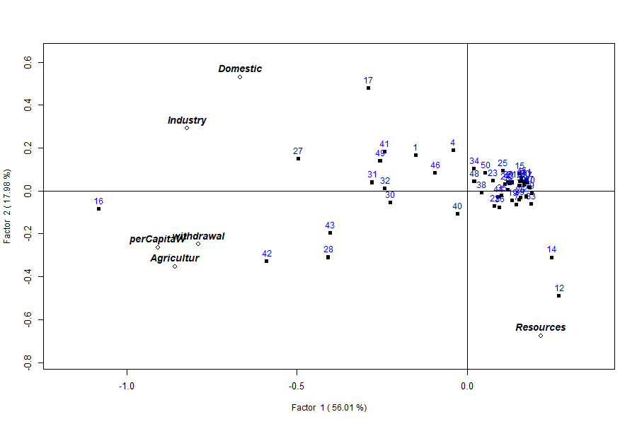

## 9. Simultaneous Q + R: the biplot

The headline output. Called with no `plot=` argument, `plot()` draws variables
(hollow diamonds, bold labels) and countries (filled squares, numbered) **on
the same two factors**, so you read both classifications at once:

```r
plot(mod)                       # or plot(mod, type = "loadings")
```


**Reading the biplot** (axis labels carry the variance: Factor 1 = 56%, Factor
2 = 18%). Variables pointing the same way are correlated; a country plotted near
a variable scores high on it. The plot resolves into meaningful regions:

- **Far left — the heavy users.** Point 16 (**Egypt**) is the extreme, joined by
  42 (**Sudan**), 28 (**Madagascar**), 27 (**Libya**), 30 (**Mali**), 31
  (**Mauritania**) and 43 (**Swaziland**) — the big agricultural abstractors,
  sitting where the `Agricultur`/`perCapitaW`/`withdrawal` arrows point. High
  water use = **negative Factor 1**.
- **Bottom-right — the water-rich.** Points 12 (**Congo**) and 14 (**DR Congo**)
  sit alone by the `Resources` arrow: vast renewable supply, almost no
  withdrawal. High resources = **negative Factor 2**.
- **Top — the domestic/industrial economies.** Point 17 (**Equatorial Guinea**,
  domestic use 132, agriculture ~1) with 1 (**Algeria**) and 4 (**Botswana**),
  where `Domestic` and `Industry` point.
- **Dense right cluster — the low-use majority.** The tight knot of small
  economies (Comoros, Cape Verde, Djibouti, Gambia, Rwanda, Togo, Uganda…).

So the axes read as: **Factor 1 = the overall scale of (agriculture-driven)
water use; Factor 2 = the resource-versus-use contrast.** Congo and Egypt land
almost as far apart as the data allows — one has the water, the other uses it.

The combined loadings and scores are available directly:

```r
head(mod$loadings)     # R-mode rows first, then Q-mode rows (56 x 6)
head(mod$scores)       # combined scores
```

Use `rowname=` to label points with a column instead of row numbers:

```r
plot(mod, rowname = "COUNTRY")
```

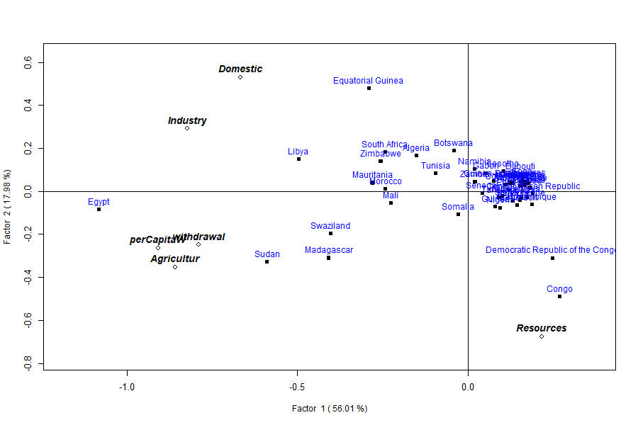

## 10. Scores

`type="scores"` plots the factor scores rather than loadings. `plot=` selects
the panel(s): `"q"`, `"r"`, `"qr"` (side by side), or `"all"` (a 3-panel
layout).

```r
plot(mod, type = "scores")               # combined
plot(mod, type = "scores", plot = "qr")  # R and Q side by side
plot(mod, type = "loadings", plot = "all")
```

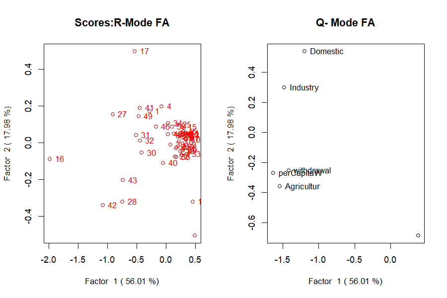

## 11. `print()` and `summary()`

`print(mod)` dumps the loadings, scores and eigenvalues.
`summary(mod)` is the compact report a factor-analysis paper wants:

```r
summary(mod)
```
```
Call:
qrfactor.default(source = csv, var = var)

 eigen  value
[1] 3.360 1.079 0.906 0.521 0.134 0.000

 Percentage Explained
[1] 56.007 17.977 15.098  8.686  2.231  0.000

 Cumulative Percentage Explained
[1]  56.01  73.98  89.08  97.77 100.00 100.00

 R-loadings
              Factor1    Factor2 ...
Domestic   -0.6666965  0.5294354 ...
...
```

## 12. Scaling: the single most important choice

`scale=` decides what matrix is decomposed, and it changes everything. The
default `"sd"` standardises each variable (correlation-based, so all variables
count equally). The covariance options (`"n"`, `"centre"`, `"data"`) leave the
raw magnitudes in, so big-numbered variables dominate.

```r
for (sc in c("sd","normal","n","centre","data"))
  print(qrfactor(csv, var = var, scale = sc)$eigen.value)
```

| `scale` | Basis | Eigenvalue 1 | Cumulative % (1st two) |
|---|---|---|---|
| `sd` (default) | correlation | 3.36 | 74.0 |
| `normal` | correlation | 3.36 | 74.0 |
| `n` | covariance / √n | 106 622 | 99.3 |
| `centre` | covariance | 5 331 116 | 99.3 |
| `data` | raw cross-product | 8 119 872 | 99.4 |

The lesson: on the correlation scale the six variables share the variance
(56%/18%); on a covariance scale one or two large-magnitude variables swallow
almost all of it (99%+). **Use `"sd"` unless you have a specific reason not
to** — and always report which you used.

## 13. Transforming skewed variables

Water-use data are strongly right-skewed (see the histograms in Section 22).
Two tools: transform *all* variables with `scale="log"`/`"sqrt"`, or transform
*named* variables with `t=`.

```r
qrfactor(csv, var = var, scale = "log")$eigen.value
#> [1] 3.4400 1.1768 1.0055 0.1807 0.1541 0.0429

# square-root just the two most skewed:
m <- qrfactor(csv, var = var, t = c("withdrawal","Resources"))
m$eigen.value
#> [1] 3.4196 1.1454 0.8854 0.3786 0.1710 0.0000
plot(m, main = "sqrt-transformed withdrawal & Resources")
```

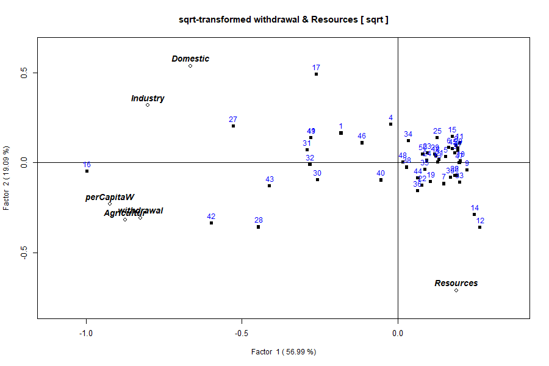

## 14. Principal coordinate analysis (PCoA)

`type="coord"` (aliases `"coordinate"`, `"pca2"`) plots the ordination from the
principal-coordinate view. Choose any pair of axes with `factors=`:

```r
plot(qrfactor(csv, var = var), plot = "all", type = "coord", factors = c(1,3))
```

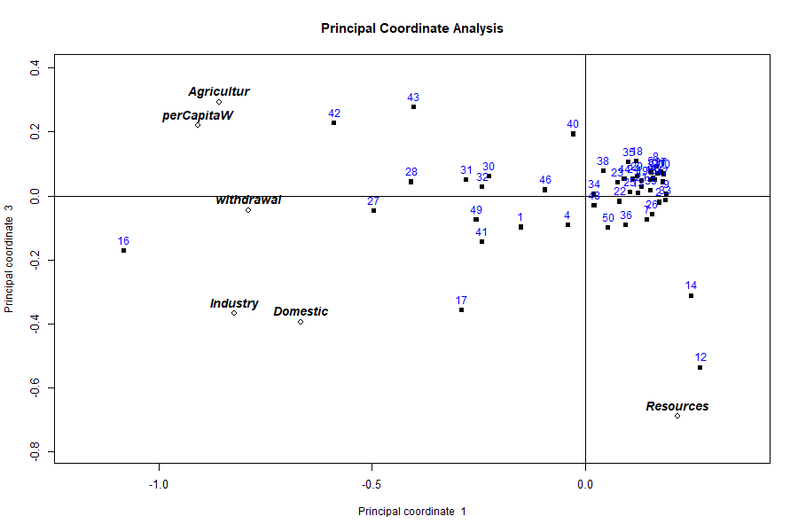

## 15. Multidimensional scaling (MDS)

MDS is simulated with `type="mds"`, conventionally on the centred/√n scale
(`scale="n"`) so the axes reflect raw dissimilarity:

```r
plot(qrfactor(csv, var = var, scale = "n"), plot = "r", type = "mds", factors = c(1,2))
```

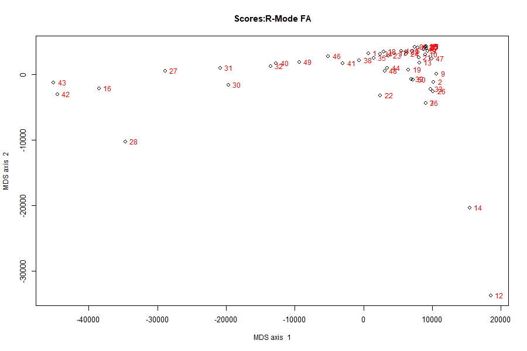

The large axis range (tens of thousands) is expected on the covariance scale —
it is the dissimilarity in the original units, not standardised.

---

# PART 2 — Spatial mode

## 16. From table to map

Part 1 produced one row of scores per country. But these are *places*, and the
natural last step is a map. Give `qrfactor()` a shapefile instead of a table
and it does the identical analysis, then writes every score, rank, index and
cluster back onto the map's attribute table — ready to draw.

## 17. Reading a shapefile

The bundled `Africanfreshwater` shapefile has the same 50 countries. Pass the
folder as `source` and the layer name (no extension) as `layer`:

```r
source <- system.file("external", package = "qrfactor")
smod   <- qrfactor(source, layer = "Africanfreshwater", var = var)
class(smod$gisdata)
#> [1] "SpatialPolygonsDataFrame"
nrow(smod$gisdata)
#> [1] 50
```

Internally the shapefile is read with `sf::st_read()` and converted to an `sp`
`Spatial*DataFrame` for plotting — you do not have to manage that.

## 18. Scores written back to the attribute table

Because `p="Yes"` by default, the fit appends its results to the attribute
table. The six input variables become **41 columns**:

```r
names(as.data.frame(smod$gisdata))
```
```
 [1] "ID" "CODE" "COUNTRY" "Year" "Domestic" "Industry" "Agricultur"
 [8] "Population" "Resources" "withdrawal" "perCapitaW" "perCapitaR"
[13] "cluster" "means" "meanrank1" "meanindex1"
[17] "Factor1" "rank1" "index1" "cluster1"
[21] "Factor2" "rank2" "index2" "cluster2"    ... (Factor3..6, etc.)
[41] "index"
```

For each retained factor you get the **score** (`Factor1`…), a **rank**, a
normalised **index** (0–1), and a **cluster** id; plus an overall **mean**,
mean-rank and mean-index. A worked row (Algeria) confirms the join:

```r
gd <- as.data.frame(smod$gisdata)
gd[gd$COUNTRY == "Algeria",
   c("COUNTRY","Domestic","Factor1","Factor2","index","means","cluster")]
#>   COUNTRY Domestic   Factor1  Factor2 index means cluster
#> 1 Algeria 37.66227 -0.276737 0.170291  0.78    60       2
```

Algeria's `Factor1` score (−0.277) is exactly the value from the non-spatial
model in Part 1 — the analysis is identical; only the container changed.

> **Caveat — cluster ids are arbitrary labels.** The `cluster*` columns come
> from `kmeans()`, whose starting points are random and *not seeded*. The
> *grouping* is stable but the *numbers* (which group is "1" vs "2") can swap
> between runs — Algeria was `cluster 1` in one run and `cluster 2` in the
> next. Loadings, scores, eigenvalues and indices are fully deterministic. If
> you need reproducible cluster ids, call `set.seed()` before `qrfactor()`.

## 19. `plot="map"`: the choropleths

```r
plot(smod, plot = "map")
```

This first draws the Q/R biplot, then a stream of `sp::spplot` choropleths: all
variables together, the scaled variables, each variable on its own, the factor
scores, the factor indices, the means, and the cluster maps. Two examples:

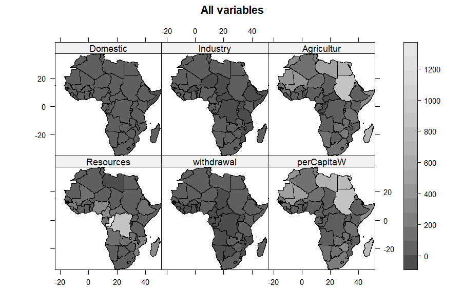

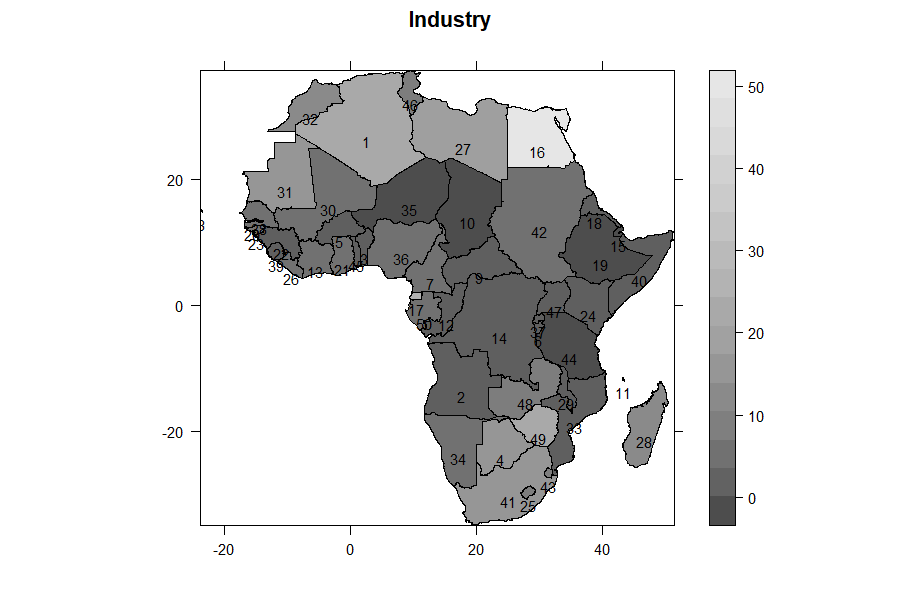

## 20. Clustering: `plot="cluster"` and `"compare"`

`plot="cluster"` runs `kmeans` on the scores, draws `cluster::clusplot`
ordination-and-hull plots, and bootstraps cluster stability with
`pvclust`. `plot="compare"` is the companion that contrasts the mean-based and
factor-based clusterings.

```r
plot(smod, plot = "cluster")
```

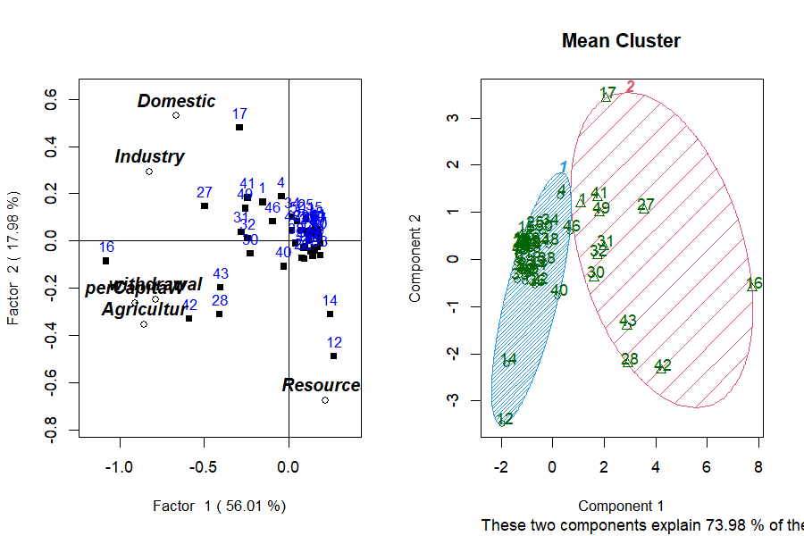

## 21. Testing the clusters: ANOVA and Kruskal–Wallis

`plot="anova"` (parametric) and `plot="nonparametric"` (Kruskal–Wallis) test
whether the variables differ across the clusters the analysis produced — the
formal check that the grouping is real. For the two mean-clusters, each variable
is tested in turn:

```
 ANOVA Table Domestic for 2 Mean clusters
            Df Sum Sq Mean Sq F value   Pr(>F)
cluster      1  16249   16249   48.79 7.76e-09 ***
Residuals   48  15987     333

 Kruskal-Wallis: Domestic by cluster
 chi-squared = 22.539, df = 1, p-value = 2.06e-06
```

Domestic, Industry, Agricultur, withdrawal and perCapitaW all separate the two
clusters at p < 0.001; `Resources` does not (F = 0.90, p = 0.35) — the clusters
are defined by *use*, not by *availability*, exactly as Factor 1 suggested.

**The two African water profiles.** The cluster means (`plot="cluster"` also
prints these) name the groups:

| Variable | Cluster A (light users) | Cluster B (heavy users) |
|---|---:|---:|
| Domestic | 10.7 | 52.9 |
| Industry | 3.3 | 17.6 |
| Agricultur | 56 | 448 |
| withdrawal | 1.2 | 14.1 |
| perCapitaW | 70 | 519 |
| **Resources** | **128** | **59** |

Cluster **B** — the heavy users (Egypt, Sudan, Libya, Mali, South Africa,
Morocco…) — withdraws roughly **8× more agricultural water** per country than
Cluster A, yet sits on **less than half the renewable resource** (59 vs 128).
Cluster **A** — the light users — is the water-rich majority. **This is the
paradox measured on the ground: the countries drawing down the most water are,
on average, the least well supplied.** The analysis has turned a rhetorical
claim ("water-rich yet water-stressed") into two quantified groups a
policymaker can name and map.

## 22. Distributional diagnostics: `type="diagnose"`

`type="diagnose"` draws a histogram (with a fitted normal curve) for every
variable, a χ² Q–Q plot of Mahalanobis distances, and flags multivariate
outliers with `mvoutlier::aq.plot`:

```r
plot(smod, type = "diagnose")
```

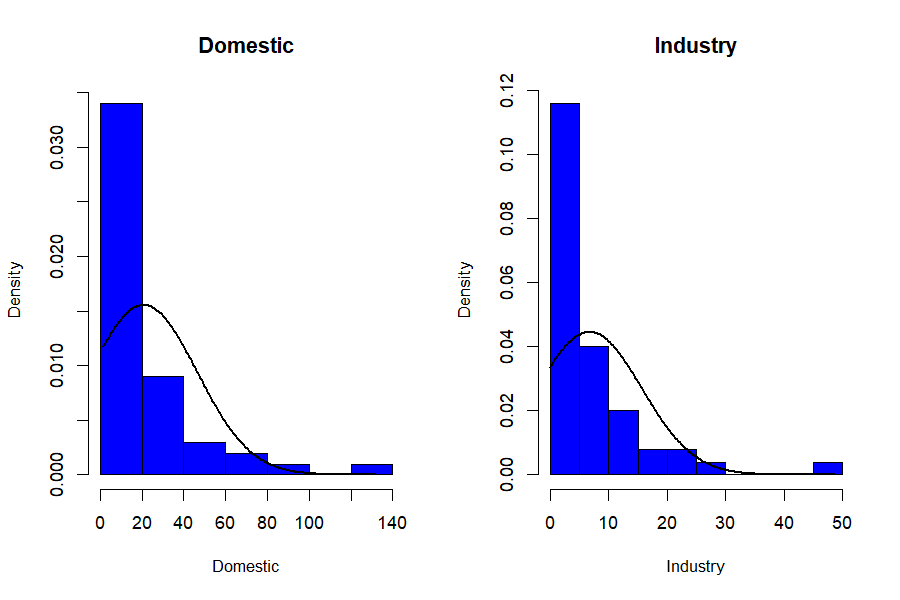

The histograms show the strong right skew typical of water-use data — the case
for the transforms in Section 13.

> **Caveat — collinearity.** The Mahalanobis/outlier panel inverts the
> covariance matrix. In this dataset `Agricultur` and `perCapitaW` are almost
> the same variable (correlation **0.992**), which makes that matrix singular.
> `qrfactor` now catches this: it draws the histograms, **skips** the
> multivariate-normality panel, and prints a warning telling you to drop or
> combine the near-duplicate variables — instead of failing outright. For a
> clean outlier panel, run `diagnose` on a non-collinear subset, e.g. drop
> `perCapitaW`.

## 23. Joining a CSV to a shapefile

If your measurements live in a CSV and your geometry in a shapefile, join them
in the call with `m=` (the shared key column) and `f=` (the CSV path):

```r
mjoin <- qrfactor(source, layer = "Africanfreshwater",
                  var = var, m = "COUNTRY", f = csv)
```

The CSV rows are matched to features by `COUNTRY`, combined (row alignment is
preserved by the internal `spCbind` replacement), and the analysis proceeds as
if the data had been in the shapefile all along.

## 24. Using an in-memory spatial object

You can also hand `qrfactor()` a spatial object you already have in the session
— set `layer="gisobject"`:

```r
gisobj <- smod$gisdata                    # a Spatial*DataFrame (or an sf object)
m2 <- qrfactor(gisobj, layer = "gisobject", var = var)
class(m2)
#> [1] "qrfactor"
```

## 24b. The African water paradox, in numbers

Pulling the whole analysis together — every figure here came from one
`qrfactor()` call on the bundled data:

| Question | What `qrfactor` answered |
|---|---|
| How many axes matter? | Two (Kaiser): 56% + 18% = **74%** of the variation |
| What is Factor 1? | The **scale of water use**, driven by agriculture (loadings −0.79 to −0.91) |
| What is Factor 2? | The **resource-vs-use contrast** (`Resources` alone, loading −0.68) |
| Is use tied to availability? | **No** — `Resources` correlates −0.04 to −0.19 with every use variable |
| Which variable is redundant? | `perCapitaW` ≈ `Agricultur` (r = **0.99**); the 6th eigenvalue ≈ 0 |
| Who uses the most? | **Egypt, Sudan, Madagascar, Libya, Mali, Mauritania, Swaziland** |
| Who has the most water? | **Congo, DR Congo** — and they barely use it |
| Do the groups differ? | Heavy vs light users separate at **p < 1e-6** on use, not on resources |
| The paradox | Heavy users hold **59** units of resource on average; light users **128** |

The methodological point for the applied reader: **one call did the work of a
PCA, an R-mode factor analysis, a Q-mode classification, a cluster analysis, an
ANOVA and a set of maps** — and, because it is map-first, the conclusion is not
a table but a picture of the continent. A worked write-up of exactly this
analysis is a natural applied paper (see `PUBLICATION_PLAN.md`, Paper 3).

**An honest caveat on causation.** These are *associations* in a single
cross-section of 50 countries, not a causal claim. The decoupling of use from
availability is real in these data, but explaining it (climate, economy,
irrigation policy, data year) is the domain expert's job, not the factor
model's. `qrfactor` locates the pattern; it does not explain it.

## 24c. What makes qrfactor robust

The package is designed so an applied user rarely gets *stuck*:

- **Pure-R core.** The whole analysis — correlation/covariance, eigen-solve,
  loadings, scores, indices — is base R. No compiled code, no build tools, and
  it installs and runs anywhere R does.
- **Graceful degradation.** When a diagnostic can't run — for example the
  Mahalanobis/`mvoutlier` outlier panel on collinear data, where the covariance
  matrix is singular — the plot method now **skips that one panel with a clear
  warning and continues**, instead of aborting the whole figure (§22). You get
  the histograms and the message, not a stack trace.
- **Dependency resilience.** The spatial stack it originally relied on
  (`rgdal`, `maptools`, `mgraph`) was retired from CRAN. `qrfactor` 1.5 replaces
  them with a thin `sf`/`sp` compatibility layer: shapefiles are read with `sf`,
  drawn with `sp`, and the conversion is automatic — so the package survives the
  modern R geospatial ecosystem rather than dying with its old dependencies.
- **Five ways in, one analysis out.** Data frame, CSV/text file, ESRI
  shapefile, an in-memory spatial object, or a live CSV↔shapefile join — the
  *same* method regardless of how your data arrives (§5, §17, §23, §24).
- **One object, many views.** Every quantity is stored on the returned object
  *and*, for spatial input, written back onto the map's attribute table (§18),
  so downstream plots and maps never recompute the analysis.
- **Modern-R hardened.** Under R ≥ 4.2 a logical condition of length > 1 is an
  error, not a silent first-element take. The constructor and the ~1700-line
  plot method were swept for this, so documented argument forms — a vector of
  variables in `t=`, a numeric `xlim`/`ylim`, string axis shortcuts, custom
  `abline` — all work instead of crashing.

None of this changes the statistics; it changes how often the statistics
actually reach you. That is what "robust" means here: **the method is classical;
the packaging is defensive.**

---

# PART 3 — Reference

## 25. `qrfactor()` argument reference

```r
qrfactor(source, layer='', var=NULL, type='', p="Yes",
         scale="sd", t='', nf=2, m=NULL, f=NULL, ...)
```

| Arg | Meaning |
|---|---|
| `source` | data frame, CSV/txt path, shapefile folder, or spatial object |
| `layer` | shapefile layer name; `"gisobject"` for an in-memory object; a filename for CSV/txt |
| `var` | character vector of variable (column) names to analyse — must be numeric |
| `type` | analysis flavour carried to `plot` (e.g. `"mds"`, `"coord"`); usually set on `plot()` |
| `p` | `"Yes"` (default) writes scores/clusters back to the attribute table |
| `scale` | `"sd"` (default, correlation), `"normal"`, `"n"`, `"centre"`, `"data"`, `"log"`, `"sqrt"` |
| `t` | character vector of variables to transform (e.g. `c("withdrawal","Resources")`) |
| `nf` | number of factors for clustering (default 2) |
| `m`, `f` | join key column and CSV path for CSV↔shapefile joins |

## 26. `plot.qrfactor()` argument reference

```r
plot(x, factors=c(1,2), type="loading", plot="",
     cex="", pch=15, pos=3, main="", xlim="optimise", ylim="optimise",
     abline=TRUE, legend="topright", legendvalues=c(100),
     values=FALSE, nfactors=3, rowname=TRUE, par=c(1,2), ...)
```

- **`type`** — *what* to draw. The full set:

  | `type` | Draws |
  |---|---|
  | `"loadings"` (default) | the Q/R loadings biplot |
  | `"scores"` | factor scores instead of loadings |
  | `"pca"` | PCA (eigenvector) loadings — **lowercase**; `"PCA"` silently falls back to the default biplot |
  | `"coord"` / `"coordinate"` | principal-coordinate view (≡ PCA on Euclidean data) |
  | `"mds"` | multidimensional-scaling view (use with `scale="n"`) |
  | `"ca"` / `"correspondence"` | eigen-biplot relabelled as "Correspondence Analysis" — a *view*, not true chi-square CA (§5b) |
  | `"diagnose"` | histograms + Q–Q + multivariate outliers |
  | `"cluster"` | `clusplot` + `pvclust` cluster diagnostics |
- **`plot`** — *which panels*: `""` (combined), `"r"`, `"q"`, `"qr"`, `"all"`,
  `"map"`, `"cluster"`, `"compare"`, `"anova"`, `"nonparametric"`.
- **`factors`** — the two axes to draw, e.g. `c(1,2)`, `c(1,3)`.
- **`rowname`** — a column name to label points (e.g. `"COUNTRY"`).
- **`cex`** — magnify text, or a variable name to size points by a variable.
- **`values`** — `TRUE`, or a variable name, to annotate points with values.
- **`xlim`/`ylim`** — `"optimise"` (auto), numeric `c(lo,hi)`, or the shortcuts
  `"r"`/`"q"`/`"qr"`.
- **`abline`** — `TRUE` for reference axes, or `c(intercept, slope)`.

```r
plot(mod, factors = c(1,3))                                # other axes
plot(mod, xlim = c(-1.5,1.5), ylim = c(-1.5,1.5))          # fixed limits
plot(mod, cex = c("withdrawal"), values = TRUE, pch = 23)  # size + annotate
plot(mod, abline = c(-0.5, 0.5))                           # custom reference line
plot(mod, rowname="COUNTRY", cex=c("withdrawal"),          # the full-dress plot
     legend="topleft", values=TRUE, pch=23)
```

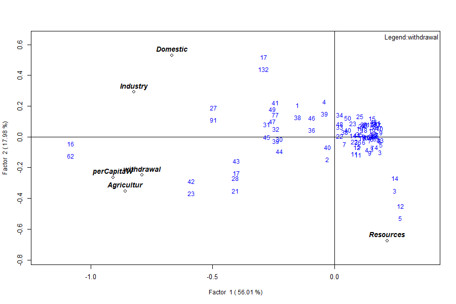

## 27. The object's elements

| Element | Class | Dim |
|---|---|---|
| `gisdata` | data.frame / Spatial | 50 × 41 (spatial) |
| `correlation` | matrix | 6 × 6 |
| `eigen.value` / `eigen.vector` | numeric / matrix | 6 / 6×6 |
| `r.loading` (`rloading`, `rloadings`) | matrix | 6 × 6 |
| `q.loading` (`qloading`, `qloadings`) | matrix | 50 × 6 |
| `combined.loadings` / `loadings` | matrix | 56 × 6 |
| `r.scores` / `q.scores` / `combined.scores` / `scores` | matrix | 50×6 / 6×6 / 56×6 |
| `pca` (`pca.loadings`) / `pca.scores` | matrix / df | 6×6 / 50×6 |
| `variance` / `cumvariance` | numeric | 6 |
| `x.standard` | matrix | 50 × 6 |
| `data` | data.frame | 50 × 6 |
| `variance`, `normal`, `transform`, `nfactors`, `call` | metadata | — |

## 28. Reproducing the figures

Every table and figure here comes from `reproduce_manual.R` in this folder:

```r
source("reproduce_manual.R")
# writes repro_output.txt and figures/*.png
```

It exercises all five input modes, all six analyses, every `scale`/`type`/`plot`
option, the print/summary/plot methods, the spatial maps, the diagnostics and
the join — and logs each figure `ok`/`FAIL`.

## 29. Honest limits and caveats

- **Numeric data only.** Categorical or character columns must be dropped or
  encoded first.
- **Collinearity.** Near-duplicate variables (here `Agricultur` ≈ `perCapitaW`,
  r = 0.992) drive the smallest eigenvalue to ~0 and make the Mahalanobis
  diagnostic singular. The last factor is then numerical noise; consider
  dropping one of the pair.
- **Cluster ids are random labels.** `kmeans` is unseeded — groupings are
  stable, id numbers are not. Seed for reproducibility.
- **`scale=` dominates the result.** Correlation vs covariance scaling changes
  the variance split from 56%/18% to 99%/… . Report your choice.
- **Case sensitivity.** `type="pca"` works; `type="PCA"` silently gives the
  default biplot.
- **`plot="map"` is verbose** — it emits the biplot plus many `spplot` pages;
  send it to a multi-page device (PDF) or a PNG sequence if you want to keep
  them.

## 30. Glossary

- **Loading** — weight relating a variable (R-mode) or sample (Q-mode) to a factor.
- **Score** — a sample's/variable's coordinate on a factor.
- **Eigenvalue** — variance captured by an axis; Kaiser rule keeps > 1.
- **R-mode / Q-mode** — classification of variables / of samples.
- **Biplot** — variables and samples on one set of axes.
- **PCoA** — principal coordinate analysis; ordination from distances.
- **MDS** — multidimensional scaling; a similarity map.
- **Choropleth** — a map coloured by a variable's value per area.
- **clusplot** — `cluster`'s ordination plot with group hulls.
- **Mahalanobis distance** — multivariate distance used for outlier detection.

## 31. Exercises

1. **Retention.** From `mod$eigen.value`, how many factors pass the Kaiser
   rule? What cumulative variance do they carry? *(Answer: two; 74%.)*
2. **Scaling.** Run `qrfactor(csv, var=var, scale="data")` and compare
   `variance` to the default. Why does Factor 1 jump to ~99%? *(Covariance
   scale lets the largest-magnitude variable dominate.)*
3. **Collinearity.** Drop `perCapitaW` from `var` and refit. What happens to
   the smallest eigenvalue, and does `type="diagnose"` now draw the outlier
   panel? *(The near-zero eigenvalue lifts; the covariance matrix is no longer
   singular, so the panel renders.)*
4. **Spatial.** Fit the shapefile model, then map `index2` for every country by
   colouring `smod$gisdata$index2`. Which countries top Factor 2?
5. **Reproducibility.** Add `set.seed(1)` before the shapefile fit and confirm
   the `cluster` ids are now stable across two runs.

---

*qrfactor — simultaneous Q- and R-mode factor analysis for spatial data. This
manual and all its numbers were produced by running the package on the bundled
African freshwater data (50 countries). Restoration of the CRAN-archived
package; see `NEWS.md` for the 1.5 change list.*
