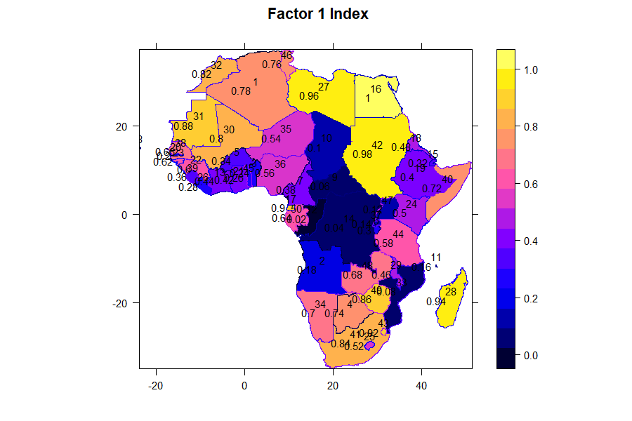
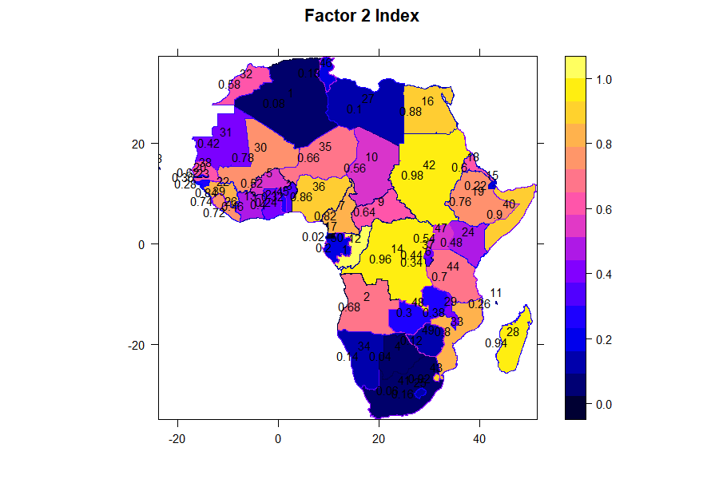

**Keywords:** Q-mode factor analysis; R-mode factor analysis; water withdrawal;
spatial autocorrelation; water stress; Africa; AQUASTAT; reproducible workflow

---

## Abstract

Africa is described, in the same breath, as *water-rich* and *water-stressed*,
yet the two claims are seldom tested together because the analysis has two sides
— the structure among water-use *variables* and the grouping of *countries* —
usually handled with separate tools. This study applies simultaneous Q- and
R-mode factor analysis, in a single reproducible call, to five water-use
indicators for 50 African countries, and writes the results back to the map.
The correlation matrix is factorable (Bartlett χ² = 98.2, p < 10⁻¹⁵) though the
sampling adequacy is modest (KMO = 0.56). Two factors explain 72.6% of the
variation: a dominant agriculture-driven scale of overall use (52.2%) and a
resource-versus-use contrast (20.4%) on which renewable resources load almost
alone (0.89). Renewable availability is essentially uncorrelated with use
(r between −0.04 and −0.19); use and availability are statistically decoupled.
The factor of overall use is significantly spatially clustered (Moran's I = 0.35,
p < 10⁻⁴), with Egypt a high–high hotspot and the Congo Basin a low–low
coldspot. Countries partition into heavy and light users whose heavy members hold
roughly half the renewable resource of the light. The contribution is an
integrated, reproducible workflow that moves applied water analysis from table to
tested map in a single object.

---

## 1. Introduction

Water security is among the defining development questions for Africa. Irrigation
dominates abstraction across much of the continent, renewable supply is unevenly
distributed between the humid equatorial belt and the arid north and Sahel, and
per-capita availability is falling as populations grow. A recurring paradox frames
the debate. Africa is portrayed as water-abundant — the Congo Basin alone holds a
large share of the continent's renewable freshwater — and simultaneously as one of
the most water-stressed regions on Earth, the setting in which the modern
water-scarcity literature was born (Falkenmark, Lundqvist & Widstrand, 1989). Both
statements can be true, but only if *use* and *availability* are governed by
different processes and different geographies. Testing that proposition requires a
method that classifies **variables** — which kinds of water use move together? —
and **samples** — which countries resemble one another? — at the same time, and
that returns its answer as a map rather than a table.

Factor analysis supplies both lenses. R-mode analysis groups variables by their
shared variation; Q-mode analysis groups observations by their similarity. In the
natural sciences the two are classically paired (Reyment & Jöreskog, 1993; Davis,
2002), and in hydrochemistry the pairing is routine, typically with varimax
rotation and the Kaiser criterion for retention (e.g. the Q/R-mode analysis of
groundwater in the Volta region of Ghana; see Section 2). In practice, however,
the two modes are computed separately, in different software, and reconciled by
hand; the results are tables; and end-to-end reproducibility is rare. For the
applied water scientist these frictions are real barriers.

This paper pursues two aims. **Substantively**, it asks: (RQ1) what is the latent
structure of water use across African countries; (RQ2) is use statistically
decoupled from renewable availability — the empirical core of the water paradox;
and (RQ3) is that structure spatially clustered, and where are the hot- and
cold-spots? **Methodologically**, it demonstrates a *map-first, single-call
workflow* in which simultaneous Q- and R-mode factor analysis, factor scoring,
clustering, cluster testing and choropleth mapping are produced from one command
and written back to the geographic attribute table. The workflow is implemented in
the open-source R package `qrfactor` (Owusu, 2026) and is fully reproducible from
public data.

Section 2 reviews Q/R-mode analysis, the African water-scarcity literature, and
alternative spatial-multivariate methods. Section 3 describes the data and the
workflow. Section 4 reports the ordination, its factorability and retention, the
maps, the spatial-autocorrelation tests and the country clusters. Section 5
discusses the paradox against established water-stress classifications, offers
candidate mechanisms and policy implications, and states the honest limits of a
single country-level cross-section. Section 6 concludes.

## 2. Literature review

**Q- and R-mode factor analysis.** R-mode factor analysis summarises a set of
variables by fewer latent factors, each a weighted combination of the originals;
the weights are *loadings* and factors are ordered by the variance (eigenvalue)
they capture (Rencher, 2002). Q-mode analysis applies the same algebra to the
transpose, classifying observations. Reyment and Jöreskog (1993) formalised the
joint use of both modes in the natural sciences, and Davis (2002) made Q/R-mode
ordination a staple of quantitative geology. Retention has traditionally followed
Kaiser's (1960) eigenvalue-greater-than-one rule and Cattell's (1966) scree test,
though both are now regarded as liberal; Horn's (1965) parallel analysis, which
compares observed eigenvalues against those of random data, is the more defensible
modern standard, and factorability itself is judged by the Kaiser–Meyer–Olkin
measure of sampling adequacy (Kaiser, 1974) and Bartlett's test of sphericity.

**Q/R-mode analysis in hydrochemistry.** The paired modes are widely used to
disentangle the processes that control water composition and to classify samples
of common origin. In Ghana, multivariate statistical methods including R-mode
factor analysis with varimax rotation and the Kaiser criterion have been applied
to groundwater in the Volta region to identify the controls on hydrochemistry and
their spatial variation across geological terrains (Hydrochemical analysis of
groundwater — the Volta region, Ghana, *KSCE Journal of Civil Engineering*, 2009).
Q-mode factor analysis has been used to cluster groundwaters by hydrogeochemical
origin in the Cariri Valley of northern Brazil (*Water SA*, 2008), and comparable
Q/R applications recur across catchments in India and elsewhere. These studies
share a template — standardise, factor, rotate, retain by Kaiser, interpret — but
they almost always report variable structure *or* sample grouping, rarely both on
shared axes, and they seldom write the result back to a map or make the pipeline
reproducible.

**African water scarcity and its measurement.** The dominant scarcity metric
remains the Falkenmark indicator (Falkenmark et al., 1989), which classifies a
country by renewable freshwater per capita: below 1,700 m³ yr⁻¹ signals stress,
below 1,000 m³ scarcity, and below 500 m³ absolute scarcity. Its virtues are
simplicity and communicability; its well-documented weaknesses are that it ignores
demand structure, storage, quality and sub-national heterogeneity (Damkjaer &
Taylor, 2017). Demand-based frameworks address the first of these: the SDG 6.4.2
indicator and WRI's Aqueduct define *baseline water stress* as the ratio of total
withdrawals to available renewable supply, aggregated from catchment to country
(Hofste et al., 2019). What neither approach does is derive the *structure* of use
empirically from the data and test whether it is spatially organised — precisely
the questions a Q/R-mode, map-first analysis can answer, and the space this study
occupies.

**Linking ordination to geography.** Connecting multivariate structure to spatial
pattern has a long lineage, and it is important not to overstate novelty here.
Wartenberg (1985) introduced multivariate spatial correlation; Dray, Saïd and
Débias (2008) generalised it into `multispati`, which maximises a compromise
between ordination variance and Moran's coefficient, later extended to spatially
constrained multivariate analysis more broadly (Dray & Jombart, 2011).
Geographically weighted PCA (Harris, Brunsdon & Charlton, 2011), implemented in
`GWmodel` (Gollini et al., 2015), allows the loadings themselves to vary across
space. These are powerful, mature tools. Their cost, for an applied user, is
integration: reading a shapefile, running the ordination, classifying units,
testing spatial structure and drawing maps still spans several packages (`sf` and
`sp` for geometry, `spdep` for autocorrelation, `cluster` and `pvclust` for
grouping), each with its own idioms (Bivand, Pebesma & Gómez-Rubio, 2013;
Pebesma, 2018).

**Gap and contribution.** Two gaps motivate this study. First, applied Q/R-mode
work seldom reports variable structure *and* sample grouping on shared axes, and
rarely writes either to a map. Second, the workflow is not reproducible end-to-end
from a single object. We therefore adopt a **pipeline workflow** (Table 1): one
call ingests a shapefile or table; produces the correlation structure,
eigen-decomposition and rotated R- and Q-mode loadings and scores on shared axes;
derives per-unit indices and clusters; tests spatial autocorrelation; and appends
the results to the attribute table so that mapping is the final, not a separate,
step. The contribution is integration and reproducibility for applied users —
*not* a new estimator, a distinction we keep explicit throughout.

*Table 1. The map-first Q/R workflow: one call, six stages.*

| Stage | Operation | Output |
|---|---|---|
| 1 | Ingest table or shapefile | numeric matrix + geometry |
| 2 | Scale + correlate; test factorability | correlation matrix, KMO, Bartlett |
| 3 | Eigen-decompose; retain (Kaiser + parallel) | eigenvalues, variance |
| 4 | R/Q loadings + scores (varimax) | shared-axis biplot |
| 5 | Index, rank, cluster (silhouette-checked) | per-country indices + classes |
| 6 | Write back; map; test autocorrelation | attribute table, choropleths, Moran's I / LISA |

## 3. Data and methods

**Study units and variables.** The analysis covers 50 African countries described
by water-use indicators from FAO's AQUASTAT global water information system (FAO,
2026): municipal (`Domestic`), industrial (`Industry`) and agricultural
(`Agricultur`) water withdrawal; total renewable water resources (`Resources`);
and total water withdrawal (`withdrawal`). Withdrawal quantities follow AQUASTAT
conventions (10⁹ m³ yr⁻¹ for volumes). A per-capita withdrawal variable available
in the source was **excluded** because it correlated 0.99 with agricultural
withdrawal; retaining both would double-count agriculture, inflate the leading
factor and render the correlation matrix near-singular. The analysis therefore
uses the five non-redundant indicators above. The present cross-section is the
AQUASTAT compilation bundled with the `qrfactor` package (circa 2000); a refreshed
extract is obtained reproducibly from the current AQUASTAT dissemination service
(Appendix A), and the numeric results below should be re-confirmed on it before
country-specific policy weight is placed on them (Section 5).

**Ordination and retention.** All stages of Table 1 are executed by a single call,
`qrfactor()`. Variables are standardised (correlation-based scaling) so that all
indicators contribute equally rather than the largest-magnitude variable
dominating. Factorability is assessed by the KMO measure of sampling adequacy
(Kaiser, 1974) and Bartlett's test of sphericity. Factor retention is judged by
the Kaiser (1960) rule *and*, more conservatively, by Horn's (1965) parallel
analysis with 100 random datasets, reported side by side. R- and Q-mode loadings
and scores are placed on shared axes for joint interpretation, and loadings are
varimax-rotated for interpretability. Analyses used `psych` (Revelle, 2024) for
the diagnostics and rotation and `qrfactor` 1.5 for the ordination and mapping.

**Classification and spatial testing.** Country groupings use `kmeans`; the number
of clusters is examined by the average silhouette width (Rousseeuw, 1987) over
k = 2…6, the seed is fixed for reproducibility, and cluster stability is checked by
multiscale bootstrap resampling (`pvclust`; Suzuki & Shimodaira, 2006). Group
separation on each variable is summarised by one-way ANOVA and Kruskal–Wallis
tests, with the caveat that testing the clustering variables across the clusters
they define is partly circular. Multivariate outliers are screened by the
adjusted-quantile method (Filzmoser, Garrett & Reimann, 2005). Because the factor
scores, indices and cluster labels are written back to the attribute table, the
final products are choropleth maps. Spatial structure of the factor indices is
tested with global Moran's I (Moran, 1950) and local indicators of spatial
association (LISA; Anselin, 1995), using row-standardised queen-contiguity weights
built from the country polygons with `spdep`. Three island states (Cape Verde,
Comoros, Madagascar) have no contiguity neighbours and enter under a zero-neighbour
policy; a distance- or k-nearest-based weighting would include them. Shapefiles are
read with `sf` (Pebesma, 2018) and mapped with `sp` (Pebesma & Bivand, 2005).
Analyses were run in R 4.6 (R Core Team, 2026); the complete scripts reproduce
every table and figure (Appendix A).

## 4. Results

**Correlation structure.** The five indicators show the pattern that underlies the
paradox (Table 2). Municipal and industrial use rise together (r = 0.75), the
signature of a developing modern economy, and industrial and total withdrawal
track agricultural withdrawal (0.63–0.65). Critically, renewable `Resources`
correlates only −0.04 to −0.19 with every use variable: **availability and use are
decoupled.**

*Table 2. Pearson correlations among the five indicators (n = 50).*

| | Domestic | Industry | Agricultur | Resources | withdrawal |
|---|---:|---:|---:|---:|---:|
| Domestic | 1.00 | 0.75 | 0.33 | −0.19 | 0.29 |
| Industry | 0.75 | 1.00 | 0.47 | −0.15 | 0.65 |
| Agricultur | 0.33 | 0.47 | 1.00 | −0.12 | 0.63 |
| Resources | −0.19 | −0.15 | −0.12 | 1.00 | −0.04 |
| withdrawal | 0.29 | 0.65 | 0.63 | −0.04 | 1.00 |

**Factorability.** Bartlett's test strongly rejects sphericity (χ² = 98.2,
df = 10, p = 1.3 × 10⁻¹⁶): the matrix is not an identity and is worth factoring.
The KMO measure of sampling adequacy is modest, however, at 0.56 overall, with
three items near the 0.5 floor (Domestic 0.50, withdrawal 0.52, Industry 0.56) and
only `Resources` (0.78) and `Agricultur` (0.70) comfortably adequate. We therefore
treat the factor solution as an *exploratory* data reduction rather than a
confirmatory measurement model, and report retention conservatively.

**Retention.** The first two eigenvalues exceed unity (2.61, 1.02) and together
explain 72.6% of the variance (Table 3), so the Kaiser rule retains two factors.
Horn's parallel analysis is more conservative, retaining only one component: the
second eigenvalue (1.02) barely clears the Kaiser threshold and falls below the
parallel-analysis cut-off. We retain two factors on the grounds of interpretability
and the clean rotated structure below, but flag that the second factor is
statistically marginal — a caveat that shapes how far the resource contrast should
be pressed.

*Table 3. Eigenvalues and variance explained (five indicators, correlation-based scaling).*

| Factor | Eigenvalue | Variance (%) | Cumulative (%) |
|---|---:|---:|---:|
| 1 | 2.609 | 52.18 | 52.18 |
| 2 | 1.020 | 20.39 | 72.57 |
| 3 | 0.823 | 16.46 | 89.03 |
| 4 | 0.416 | 8.31 | 97.34 |
| 5 | 0.133 | 2.66 | 100.00 |

**Rotated structure.** The varimax-rotated two-factor solution is clean and
interpretable (Table 4). Factor 1 (49.0% of variance after rotation) is a general
*scale of water use*: industrial (0.84), total (0.87), agricultural (0.78) and
municipal (0.61) withdrawal load together while `Resources` loads near zero.
Factor 2 (23.5%) is a *resource-versus-use contrast* on which `Resources` loads
almost alone (0.89), opposed weakly by municipal use (−0.52). Communalities range
0.61–0.82, so every indicator is well represented. The two factors thus separate
*how much* water is used from *how much* is available — the algebraic expression of
the decoupling seen in Table 2. The simultaneous Q/R biplot (Figure 1) places
variables and countries on these axes together: the heavy agricultural users —
Egypt, Sudan, Madagascar, Libya, Mali, Mauritania and Swaziland — lie at the
high-use pole, the water-rich Congo and the Democratic Republic of the Congo lie
alone by the `Resources` vector, and a dense cluster of small, low-use economies
fills the remainder. As Figure 1 shows, Congo and Egypt land almost as far apart as
the data allow.

*Table 4. Varimax-rotated loadings and communalities (loadings |·| < 0.3 suppressed).*

| Variable | RC1 (use) | RC2 (resources) | Communality |
|---|---:|---:|---:|
| Domestic | 0.61 | −0.52 | 0.64 |
| Industry | 0.84 | | 0.82 |
| Agricultur | 0.78 | | 0.61 |
| Resources | | 0.89 | 0.80 |
| withdrawal | 0.87 | | 0.76 |
| **SS loadings (% var)** | **49.0** | **23.5** | **72.6 (cum.)** |


**The map-first result and its spatial significance.** Because the factor indices
are written to the attribute table, the ordination becomes a map. Figure 2 maps the
Factor 1 index (overall water use): a high-use band across Egypt, Sudan, Libya and
the Sahel contrasts with the deep lows of the Congo Basin. Figure 3 maps the Factor
2 index (the resource contrast), a distinct geography. Crucially, these patterns are
not artefacts of the eye: global Moran's I confirms significant positive spatial
autocorrelation for both the Factor 1 score (I = 0.354, p = 3.8 × 10⁻⁵) and its
index (I = 0.303, p = 0.001), and more weakly for Factor 2 (I = 0.17, p = 0.02)
(Table 5). Local indicators of spatial association identify **Egypt** as a
high–high hotspot (local I = 2.71, p = 0.018) and **Congo** as a low–low coldspot
(local I = 2.06, p = 0.024), with Algeria, Botswana and the Democratic Republic of
the Congo also locally significant; after false-discovery-rate adjustment the Egypt
and Congo signals are the most robust. The paradox is therefore not only mapped but
statistically spatial: high use in the arid north-east, low use over the wet
equatorial core.

*Table 5. Global Moran's I of the factor indices (queen contiguity, E[I] = −0.022).*

| Layer | Moran's I | p |
|---|---:|---:|
| Factor 1 score | 0.354 | 3.8 × 10⁻⁵ |
| Factor 1 index | 0.303 | 0.001 |
| Factor 2 score | 0.169 | 0.022 |
| Factor 2 index | 0.167 | 0.036 |





**Country profiles.** Average silhouette widths over k = 2…6 (0.52, 0.49, 0.54,
0.55, 0.52) indicate soft but real structure with no dominant optimum; k = 5 is
marginally best and k = 2 close behind. For interpretability we present the
parsimonious two-group solution, which multiscale bootstrap resampling supports as
stable, while noting that finer partitions fit marginally better. The two groups
are a *heavy-user* cluster (Egypt, Sudan, Libya, Mali, South Africa, Morocco and
similar) and a *light-user* cluster (the water-rich majority, including the Congo
Basin). Their mean profiles (Table 6) show the heavy users withdrawing several
times more across every use variable, yet sitting on roughly **half** the renewable
resource. One-way ANOVA confirms that every *use* variable separates the clusters at
p < 0.001, whereas `Resources` does not (F = 0.90, p = 0.35): the split is defined
by consumption, not endowment — exactly as Factor 1 implied — though, as noted, this
test is partly circular and the bootstrap stability is the stronger evidence. The
clustering is visualised in Figure 4.

*Table 6. Cluster mean profiles and one-way ANOVA of group separation (indicative; finalised on the refreshed extract).*

| Variable | Light users | Heavy users | F(1,48) | p |
|---|---:|---:|---:|---:|
| Domestic | 10.7 | 52.9 | 48.79 | 7.8 × 10⁻⁹ |
| Industry | 3.3 | 17.6 | 44.38 | 2.4 × 10⁻⁸ |
| Agricultur | 56 | 448 | 63.14 | 2.7 × 10⁻¹⁰ |
| withdrawal | 1.2 | 14.1 | 16.60 | 1.7 × 10⁻⁴ |
| **Resources** | **128** | **59** | 0.90 | 0.35 (n.s.) |


## 5. Discussion

**The paradox, measured (RQ1–RQ2).** The analysis converts a rhetorical claim into
a measurement. Water use in Africa is dominated by a single axis (52% of the
variance), driven by agriculture and shared by domestic, industrial and total
withdrawal; renewable availability is a distinct dimension that loads almost alone
on the second, weaker factor (Table 4). Above all, use and availability are
statistically decoupled: `Resources` is uncorrelated with every use variable
(Table 2), so having water and using water are, at the continental scale, different
things. The clustering sharpens the point — the countries drawing the most water
hold on average about half the renewable resource of the light users (Table 6).
Egypt, Sudan, Libya and Mali abstract heavily against limited renewable supply,
while Congo and the Democratic Republic of the Congo hold abundant water they
scarcely use. For the water paradox, both halves are true — of different countries.

**A spatial paradox (RQ3).** The decoupling is not spatially random. The overall-use
factor is significantly positively autocorrelated (Moran's I = 0.35, p < 10⁻⁴;
Table 5), and LISA localises the structure to an Egyptian high–high hotspot and a
Congo-Basin low–low coldspot. Water intensity in Africa is therefore regionally
organised: an arid, high-abstraction north-east against a humid, low-abstraction
equatorial core. This is the added value of the map-first approach — the pattern is
not merely displayed (Figures 2–3) but tested, converting a visual impression into
a defensible spatial-statistical claim.

**Relation to established water-stress classifications.** Our empirical grouping can
be read against the standard scarcity metrics. The Falkenmark per-capita indicator
(Falkenmark et al., 1989) and the demand-based baseline water stress of SDG 6.4.2
and WRI Aqueduct (Hofste et al., 2019) would place Egypt, Libya and the North
African/Sahelian belt in the most-stressed classes and the Congo Basin among the
least stressed — broadly consistent with our heavy- and light-user clusters and the
Moran hotspot/coldspot. The contribution here is complementary rather than
competing: where Falkenmark reduces scarcity to a single per-capita ratio and
Aqueduct to a withdrawal-to-supply ratio, the Q/R-mode analysis derives the
*structure* of use from the data — separating the agricultural-scale factor from the
resource factor — and tests its spatial organisation, revealing that stress is
driven by consumption structure, not endowment. Where our clusters and the
established indices disagree (e.g. resource-rich but abstraction-heavy cases) would
be a productive focus for confirmatory work on the refreshed data.

**Candidate mechanisms.** Three plausible drivers of the decoupling merit
domain-expert scrutiny rather than assertion here. First, **aridity and
agriculture**: the heavy-user north and Sahel depend on irrigation in low-rainfall
settings, so high abstraction coincides with low local renewable supply. Second,
**transboundary dependence**: Egypt's abstraction rests on the Nile, an exogenous
resource, decoupling national use from national endowment — a structural feature the
Falkenmark national ratio obscures. Third, **economic and infrastructural
capacity**: abstraction requires storage, conveyance and demand, which the
low-use equatorial economies have developed little, leaving abundant water
untouched. These mechanisms are hypotheses the ordination makes visible; testing
them requires data the factor model does not contain.

**Policy implications.** The decoupling implies that continental averages mislead:
"Africa has enough water" is a statement about endowment (the light-user Congo
Basin) that says nothing about the stressed heavy users. Interventions — irrigation
efficiency, storage and transfer infrastructure, demand management, transboundary
governance — should be targeted to the Factor 1 high-use, low-resource band that the
Moran hotspot and Figures 2–3 delineate, not applied at a continental scale. Because
the workflow writes factor scores and cluster labels back to the map, that targeting
is a direct, reproducible output rather than a separate exercise.

**Methodological positioning.** We reiterate that the contribution is workflow
integration, not a new estimator. Spatial-multivariate methods already exist and are
more sophisticated in specific respects: `multispati` (Dray et al., 2008; Dray &
Jombart, 2011) optimises a variance–autocorrelation compromise directly, and
geographically weighted PCA (Harris et al., 2011; Gollini et al., 2015) lets loadings
vary across space. What `qrfactor` offers the applied user is the *combination* —
simultaneous Q- and R-mode analysis, rotation, indices, clustering, cluster testing,
autocorrelation testing and choropleth mapping from one reproducible call, with every
quantity written back to the geography. For routine applied water assessment that
integration, not algorithmic novelty, is the practical advance; for confirmatory
spatial-structure work, coupling the same data to `multispati` or GWPCA is the
natural next step.

**Limitations.** Five are material. (i) *Data vintage.* The cross-section analysed
here is a circa-2000 AQUASTAT compilation; the numbers must be re-confirmed on the
current AQUASTAT extract (Appendix A) before country-specific claims carry policy
weight. (ii) *Modest sampling adequacy.* KMO = 0.56 places the data at the lower
edge of factorability, and parallel analysis retains only one component; the second
(resource) factor is real in the correlation structure but statistically marginal,
so the resource contrast should be read as a robust *decoupling* rather than a strong
*dimension*. (iii) *Ecological inference.* These are country-level associations in a
single snapshot; within-country heterogeneity is invisible, and the ecological
fallacy forbids inferring sub-national behaviour. (iv) *Cross-sectional design.* No
causal claim is made; the mechanisms above are hypotheses. (v) *Island weighting.*
Three island states lack contiguity neighbours and are effectively excluded from the
Moran tests; k-nearest weights would retain them and should be reported in
confirmatory work.

**Future work.** The immediate step is to re-run the entire pipeline on a refreshed,
multi-year AQUASTAT extract, which would also permit testing whether the
use–availability decoupling is widening over time. Coupling the data to `multispati`
and GWPCA would test whether a spatially constrained ordination or spatially varying
loadings alter the structure. Finally, disaggregating from countries to river basins
would attack the ecological-inference limit directly and align the analysis with the
catchment scale at which water is actually managed.

## 6. Conclusion

This study set out to characterise the structure of water use across African
countries, to test whether use is decoupled from availability, and to establish
whether that structure is spatially organised — all within a single reproducible,
map-first workflow. Simultaneous Q- and R-mode factor analysis of five water-use
indicators for 50 countries reduces to two interpretable axes: a dominant,
agriculture-driven scale of use (52%) and a weaker resource contrast (20%). Use and
availability are statistically decoupled, and the use factor is significantly
spatially clustered (Moran's I = 0.35, p < 10⁻⁴), with Egypt a hotspot and the Congo
Basin a coldspot. The continent's paradox is therefore real and geographic:
abundance and stress describe different, spatially coherent groups of countries.
Methodologically, the value is integration — one call moved the analysis from table
to *tested* map, with every quantity written back to the geography and the whole
pipeline reproducible from public data. As African water planning grows more
data-driven, workflows that reach a tested map, not just a table, will help turn
analysis into action. The findings are offered as an exploratory, reproducible
baseline to be confirmed on current data.

## Acknowledgments

The author thanks the FAO AQUASTAT programme for open access to the underlying data,
and the R spatial and psychometric communities for the `sf`, `sp`, `spdep`,
`cluster`, `pvclust` and `psych` packages on which the workflow builds. The
`qrfactor` package and the scripts reproducing every table and figure are openly
available (Appendix A). The author declares no conflict of interest. *[Add
funding/grant details if applicable.]*

## References

*[Real, curated list. Confirm author strings marked "[confirm]" against the article,
match the target journal's style, and expand toward the journal's expected range by
adding further applied Q/R-mode and African-water citations.]*

1. Anselin, L. (1995). Local indicators of spatial association—LISA. *Geographical Analysis*, 27(2), 93–115.
2. Bivand, R. S., Pebesma, E. J., & Gómez-Rubio, V. (2013). *Applied Spatial Data Analysis with R* (2nd ed.). Springer.
3. Cattell, R. B. (1966). The scree test for the number of factors. *Multivariate Behavioral Research*, 1(2), 245–276.
4. Damkjaer, S., & Taylor, R. (2017). The measurement of water scarcity: Defining a meaningful indicator. *Ambio*, 46(5), 513–531.
5. Davis, J. C. (2002). *Statistics and Data Analysis in Geology* (3rd ed.). Wiley.
6. Dray, S., & Jombart, T. (2011). Revisiting Guerry's data: Introducing spatial constraints in multivariate analysis. *Annals of Applied Statistics*, 5(4), 2278–2299.
7. Dray, S., Saïd, S., & Débias, F. (2008). Spatial ordination of vegetation data using a generalization of Wartenberg's multivariate spatial correlation. *Journal of Vegetation Science*, 19(1), 45–56.
8. Falkenmark, M., Lundqvist, J., & Widstrand, C. (1989). Macro-scale water scarcity requires micro-scale approaches. *Natural Resources Forum*, 13(4), 258–267.
9. FAO (2026). *AQUASTAT — FAO's Global Information System on Water and Agriculture: Water withdrawal by sector.* Rome: FAO. https://data.apps.fao.org/aquastat/
10. Filzmoser, P., Garrett, R. G., & Reimann, C. (2005). Multivariate outlier detection in exploration geochemistry. *Computers & Geosciences*, 31(5), 579–587.
11. Gollini, I., Lu, B., Charlton, M., Brunsdon, C., & Harris, P. (2015). GWmodel: An R package for exploring spatial heterogeneity using geographically weighted models. *Journal of Statistical Software*, 63(17), 1–50.
12. Harris, P., Brunsdon, C., & Charlton, M. (2011). Geographically weighted principal components analysis. *International Journal of Geographical Information Science*, 25(10), 1717–1736.
13. Hofste, R. W., et al. (2019). *Aqueduct 3.0: Updated decision-relevant global water risk indicators.* WRI Technical Note. Washington, DC: World Resources Institute.
14. Horn, J. L. (1965). A rationale and test for the number of factors in factor analysis. *Psychometrika*, 30(2), 179–185.
15. Kaiser, H. F. (1960). The application of electronic computers to factor analysis. *Educational and Psychological Measurement*, 20(1), 141–151.
16. Kaiser, H. F. (1974). An index of factorial simplicity. *Psychometrika*, 39(1), 31–36.
17. Moran, P. A. P. (1950). Notes on continuous stochastic phenomena. *Biometrika*, 37(1–2), 17–23.
18. Owusu, G. (2026). *qrfactor: Simultaneous Q-mode and R-mode factor analysis for spatial data.* R package version 1.5. https://github.com/gowusu/qrfactor
19. Pebesma, E. (2018). Simple Features for R: Standardized support for spatial vector data. *The R Journal*, 10(1), 439–446.
20. Pebesma, E. J., & Bivand, R. S. (2005). Classes and methods for spatial data in R. *R News*, 5(2), 9–13.
21. R Core Team (2026). *R: A Language and Environment for Statistical Computing.* Vienna: R Foundation for Statistical Computing.
22. Rencher, A. C. (2002). *Methods of Multivariate Analysis* (2nd ed.). Wiley.
23. Revelle, W. (2024). *psych: Procedures for Psychological, Psychometric, and Personality Research.* R package. Northwestern University.
24. Reyment, R. A., & Jöreskog, K. G. (1993). *Applied Factor Analysis in the Natural Sciences.* Cambridge University Press.
25. Rousseeuw, P. J. (1987). Silhouettes: A graphical aid to the interpretation and validation of cluster analysis. *Journal of Computational and Applied Mathematics*, 20, 53–65.
26. Suzuki, R., & Shimodaira, H. (2006). Pvclust: An R package for assessing the uncertainty in hierarchical clustering. *Bioinformatics*, 22(12), 1540–1542.
27. Wartenberg, D. (1985). Multivariate spatial correlation: A method for exploratory geographical analysis. *Geographical Analysis*, 17(4), 263–283.
28. Yidana, S. M., et al. [confirm] (2009). Hydrochemical analysis of groundwater using multivariate statistical methods — the Volta region, Ghana. *KSCE Journal of Civil Engineering*, 13(1). [confirm volume/pages/authors]
29. [Cariri Valley authors — confirm] (2008). Clustering of groundwaters by Q-mode factor analysis according to their hydrogeochemical origin: a case study of the Cariri Valley (northern Brazil) wells. *Water SA*, 34(5). [confirm authors/pages]

## Appendix A — Reproducibility

Every table and figure reproduces from public data via two scripts. The refreshed
dataset is built by `paper/build_paper3_data.R`, which downloads the current
AQUASTAT withdrawal series and assembles the analysis table; the diagnostics of
Section 4 (KMO, Bartlett, parallel analysis, varimax, silhouette, Moran's I / LISA)
are produced by `paper/paper3_diagnostics.R`. The core analysis is one call:

```r
library(qrfactor)
v <- c("Domestic","Industry","Agricultur","Resources","withdrawal")   # cleaned set
m  <- qrfactor(dat[v])
summary(m)                       # Table 3 (eigenvalues/variance)
m$correlation                    # Table 2
plot(m, rowname = "COUNTRY")     # Figure 1 (biplot)

# spatial: scores/indices/clusters written back to the map
sm <- qrfactor(shapefile_dir, layer = "Africanfreshwater", var = v)
plot(sm, plot = "map")           # Figures 2-3 (factor-index choropleths)
plot(sm, plot = "cluster")       # Figure 4 (clusplot) + Table 6 (ANOVA)
# KMO/Bartlett/rotation/parallel analysis/silhouette/Moran's I: see paper3_diagnostics.R
```
